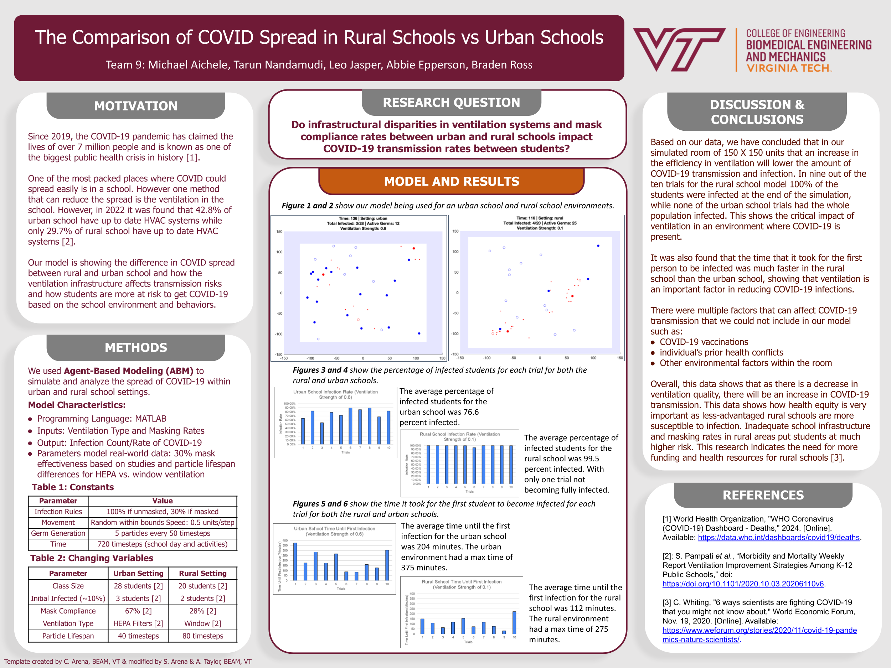

# COVID-19 School Transmission Model
## Agent-Based Modeling of Urban vs Rural School Settings

This repository contains a MATLAB-based agent-based model (ABM) that simulates COVID-19 transmission in different school environments. The model was developed to analyze how infrastructural disparities in ventilation systems and mask compliance rates between urban and rural schools impact COVID-19 transmission rates among students.

### Research Poster

*View the full research poster [here](./research_poster.pdf)*

### Background

The simulation was created as part of a group research project examining health equity issues in school COVID-19 transmission. While I developed all the code for the model, the results and analysis were collaboratively used by the team (Michael Aichele, Tarun Nandamudi, Leo Jasper, Abbie Epperson, Braden Ross) to create the final research presentation.

### Model Features

The simulation implements the following key features:

- **Student Movement**: Students move randomly within a bounded 150x150 unit space
- **Infection Mechanics**: Models transmission via particle spread and interaction
- **Ventilation Effects**: Simulates different ventilation systems (HEPA vs. Windows)
- **Mask Compliance**: Incorporates varying mask usage rates based on school setting
- **Real-world Parameters**: Uses actual data for class sizes and compliance rates

#### Key Parameters

Urban Schools:
- Class Size: 28 students
- Initial Infected: 3 students (~10%)
- Mask Compliance: 67%
- Ventilation: HEPA Filters
- Particle Lifespan: 40 timesteps

Rural Schools:
- Class Size: 20 students
- Initial Infected: 2 students (~10%)
- Mask Compliance: 28%
- Ventilation: Window-based
- Particle Lifespan: 80 timesteps

### Code Structure

The codebase consists of three main components:

1. **Helper Functions**:
   - `PlaceCell()`: Generates random positions
   - `ComputeDistance()`: Calculates distance between points
   - `ComputeAngle()`: Determines angle between points

2. **Setup and Configuration**:
   - Simulation parameters
   - School demographics
   - Student initialization
   - Ventilation parameters

3. **Main Simulation Loop**:
   - Student movement
   - Germ propagation
   - Infection mechanics
   - Statistics tracking
   - Visualization

### Results

The simulation revealed significant disparities between urban and rural school settings:

- Rural Schools:
  - 99.5% average infection rate
  - 112 minutes average time to first infection
  - 9/10 trials reached 100% infection

- Urban Schools:
  - 76.6% average infection rate
  - 204 minutes average time to first infection
  - No trials reached 100% infection

### Usage

To run the simulation:

1. Ensure MATLAB is installed
2. Set school type in code (`schoolType = ['urban']` or `schoolType = ['rural']`)
3. Run `NewABMModel.m`
4. View real-time visualization and final statistics

### Visualization

The model provides real-time visualization showing:
- Student positions (masked/unmasked, infected/uninfected)
- Germ particles
- Ventilation zones
- Current statistics

### Implementation Details

The model uses several sophisticated mechanisms:

1. **Particle System**:
   - Germs are generated in waves
   - Each particle has tracking for age and interactions
   - Ventilation effects remove particles based on position

2. **Infection Mechanics**:
   - Mask effectiveness reduces transmission chance
   - Distance-based interaction
   - Particle lifespan varies by ventilation type

3. **Statistics Tracking**:
   - Infection rates over time
   - Masked vs unmasked transmission
   - Time to first infection
   - Peak infection rates

### Notes

- Simulation is time-stepped with configurable duration
- Parameters can be adjusted for different scenarios
- Visualization can be disabled for faster execution
- Statistics are saved for analysis

The code was developed independently, while the research presentation and conclusions were created collaboratively by the team using the simulation results.
